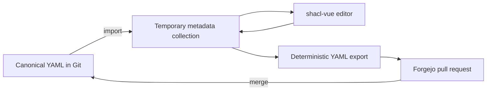

# CON metadata model and gap analysis

Updated: 2026-07-22

## Purpose

Define a repository-native metadata model that can represent everything meaningfully published on the current Center for Open Neuroscience website, generate a static replacement website, and later feed a CON deployment of `dump-things-service` and `shacl-vue` without a second metadata migration.

This document refines Phase 3 of the [working plan](orinoco-con-website-plan.md).

## Confirmed constraints

- Use the Forgejo [`orinoco`](https://hub.psychoinformatics.de/orinoco/) repositories as upstream. Do not use Codeberg `datalink` repositories.
- Gather and tune records through agents and manual review initially.
- Keep the initial source of truth in ordinary files in Git.
- Preserve all information currently published on the live site, including public email addresses, profile links, biographies, images, project descriptions, references, supporters, and promotional resources.
- Design the records so they can be imported into a future [`shacl-vue`](https://hub.psychoinformatics.de/orinoco/shacl-vue) editing workflow.
- Generate a static public website. The metadata editor and API must not be runtime dependencies of the public site.

## Canonical serialization

### Decision: one YAML record per file

YAML is the canonical authoring format. Each file contains exactly one record.

JSONL remains useful as a generated interchange format for `dtc`, `qri`, VisiData, bulk validation, and streaming transformations. It should not be manually maintained because one-record-per-line documents produce poor reviews, large merge conflicts, and awkward multiline prose.

| Format | Canonical? | Intended use |
|---|---|---|
| YAML, one record per file | Yes | Human and agent editing, review, history, and merge conflict isolation |
| JSONL | No | Generated stream for query and rendering tools |
| JSON arrays grouped by class | No | Compatibility export for the current `dump-research-info` loader |
| Turtle/RDF | No | Generated linked-data export and interoperability |
| Hugo Markdown | No for factual metadata | Generated pages, plus exceptional editorial prose that has no useful metadata representation |

### Record rules

1. Every YAML file contains one mapping and one `pid`.
2. Every record has an explicit `schema_type`.
3. PIDs, not filenames or relative paths, identify links between records.
4. A PID occurs in exactly one canonical file.
5. Filenames use stable, readable slugs and may be renamed without changing identity.
6. Multiline prose uses YAML literal blocks and Markdown where links or basic structure are needed.
7. Dates are quoted ISO values because YAML parsers otherwise coerce them inconsistently.
8. Source URL, retrieval date, review status, and reviewer are recorded as metadata, not YAML comments.
9. Generated files never feed back into canonical records.
10. Deterministic formatting and key ordering are enforced when records are changed mechanically.

## Proposed repository layout

```text
metadata/
  records/
    organizations/
    people/
    projects/
    instruments/
    datasets/
    activities/
    documents/
    publications/
    grants/
    objectives/
    topics/
    depictions/
    vocabularies/
  site/
    navigation.yaml
    collections.yaml
    pages.yaml
    redirects.yaml
  schema/
    lock.yaml
media/
  people/
  projects/
  documents/
  organization/
templates/
content/
  editorial/
build/
```

`metadata/records` contains research-information records. `metadata/site` contains presentation configuration such as navigation order, featured collections, page composition, and old-to-new redirects. This separation prevents display decisions from becoming false claims about research entities.

`content/editorial` is reserved for narrative that is genuinely page-specific and not reusable as structured information. It should be small. The six CON principles, people, projects, outputs, supporters, resources, and references can all be represented as records; layout instructions cannot.

`build` contains generated JSONL, generated Hugo content, graph data, and the rendered site. It is disposable and should normally be ignored by Git.

## Identity policy

### Recommended namespace

Use an HTTP namespace controlled by CON:

```yaml
prefixes:
  con: https://centerforopenneuroscience.org/id/
```

Example local PIDs:

```text
con:people/john-lee
con:projects/datalad
con:instruments/datalad
con:roles/centroid
con:topics/reproducibility
con:documents/datalad-brochure
```

Use globally governed identifiers as the primary PID when they identify the same thing unambiguously:

- ROR for organizations;
- DOI for publications;
- ORCID as a person's identifier, not normally the person record's PID;
- ISSN for publication venues;
- resolvable canonical identifiers for grants when available.

Existing `xyzrins:` PIDs should be retained as exact mappings or aliases during migration, not silently reused as CON's permanent namespace. Public page URLs are separately configured, so a PID change does not require a public URL change.

## Example person record

```yaml
schema_type: xyzri:XYZPerson
pid: con:people/example-person
given_name: Example
family_name: Person
formatted_name: Example Person
description: |-
  Biography preserved from the current CON website, with links represented
  in Markdown where they are part of the prose.
delegated_by:
  - object: ror:04tfhh831
    roles:
      - con:roles/centroid
      - con:roles/research-software-engineer
identifiers:
  - schema_type: dlthings:Identifier
    notation: example-person
    creator: rrid:SCR_002630
attributes:
  - schema_type: dlthings:AttributeSpecification
    predicate: vcard:Email
    value: example@centerforopenneuroscience.org
depiction:
  - con:depictions/people/example-person
annotations:
  con:source-url: https://centerforopenneuroscience.org/whoweare
  con:review-status: needs-review
```

The exact annotation representation must be checked against the current schema before implementation; the conceptual fields above are required even if their final serialization differs.

## Core modeling patterns

| CON concept | Primary representation | Relationship pattern |
|---|---|---|
| Center for Open Neuroscience | `XYZOrganization`, PID `ror:04tfhh831` | Organization identity, location, contact attributes, identifiers, depiction, and parent organization relationships |
| Person | `XYZPerson` | `delegated_by` CON with one or more membership/position roles; project participation is derived from project `associated_with` relations |
| Membership category | `XYZAgentRole` | CON-specific roles for centroid, collaborator, affiliated faculty, and emeritus; professional roles may use established vocabularies where exact |
| Research or community endeavor | `XYZProject` | People and organizations through `associated_with`; parent initiatives through `part_of`; aims through `influenced_by` or linked objectives |
| Software, platform, archive service, or practical tool | `XYZInstrument` | Link to the project that develops or maintains it; topics through `about`; responsible people through `attributed_to` |
| Dataset or data collection | `XYZDataset` | Link to project, creators/curators, topics, standards, license rules, and distributions |
| Meeting or time-bounded event | `XYZActivity` | Start/end, location, participants, parent event series/project, outputs, and topics |
| Standard or specification | `Convention` or `XYZDocument` | Prefer `Convention` for the normative standard and `XYZDocument` for a specific published specification; connect conforming entities with `conforms_to` |
| Training module or brochure | `XYZDocument` | Topic/project links, creators, license, depictions, and downloadable distributions |
| Publication | `XYZPublication` | DOI PID where available, authors through `attributed_to`, venue, bibliographic kind, topics, and related projects |
| Grant or award | `XYZGrant` | Funder and investigators through attribution/influence patterns; connect to supported projects |
| Principle | `XYZConcept` initially | Mark with a controlled CON principle kind and connect to the organization; site YAML controls order |
| Operational objective | `XYZObjective` | Connect to organization/projects and other objectives with `part_of` and `depends_on` |
| Research/domain topic | `XYZTopic` | Reusable classification through `about`; topics may form a hierarchy with `part_of` |
| Portrait, logo, banner, or thumbnail | `XYZDepiction` plus `XYZFile` | `depiction` links from the subject; local path is the first distribution; preserve source and license |
| Website page | Site YAML, optionally `XYZDocument` | Page composition and navigation are presentation data; a page becomes a document record only when it is itself a reusable or citable resource |
| Testimonial or quotation | Editorial content or `XYZDocument` plus quotation provenance | Preserve the current quotation and source note; do not invent an identified author |

## Current live-site inventory and gaps

The live source is unusually compact: one homepage template and four content pages. The data inside those pages is much richer than the page count suggests.

| Current content | Observed inventory | Existing seed coverage | Required action |
|---|---:|---|---|
| CON organization, ROR, address, team email, GitHub, Twitter, tagline | 1 organization/footer shared across pages | Organization record exists | Reconcile every contact and identifier; add explicit source and license data |
| Principles | 6 | Not represented as a complete set | Create six `XYZConcept` records and a site collection preserving their order |
| Homepage references | 3 publications | Some publication records exist | Match by DOI, add missing records, and preserve PDF/alternate links |
| Homepage testimonial | 1 quotation | Not modeled | Preserve as reviewed editorial content with its anonymous source description |
| People | 33 people across 4 membership groups | 33 person records | Reconcile all names, roles, biographies, affiliations, public emails, phone, identifiers, project links, and 33 portraits |
| Featured project entries | 22 entries across software, initiative, meeting, standard, education, and infrastructure sections | 22 generic project records | Split project endeavors from their outputs where appropriate; retain public grouping in site configuration |
| Software/platform/archive products | 15 entries under the current Software heading | Stored as projects | Create `XYZInstrument` or `XYZDataset` output records where the project and product are conceptually distinct |
| Initiative | Open Brain Consent | Project exists | Preserve project, publication, internationalization links, and consent-material outputs |
| Meeting/community | distribits plus general OHBM/SfN activity text | Project exists for distribits | Model distribits as an ongoing project/community and meeting editions as activities when edition data is added |
| Standards | BIDS, NWB:N, and YODA | Stored as projects | Represent normative standards/specifications explicitly and keep project records only for ongoing endeavors |
| Education | ReproNim Reproducible Basics | Stored as project | Represent the training module as a document or instrument linked to ReproNim |
| Infrastructure | SingularityHub after-life archive/service | Stored as project | Represent the archival endeavor plus service/dataset output and its 9 TB claim/source |
| Grants visible on project pages | DANDI, EMBER, OpenNeuro | 3 grant records, with two documented placeholder links | Replace placeholders from current live NIH Reporter links and verify identifiers |
| Support page | CCN, one NSF award, one NIH award | Incomplete | Add funder/host organizations and grant records; distinguish center support from project funding |
| Collaborating projects | 39 named/linkable projects or tools | Not part of the 22 featured records | Create lightweight records with relationship role and source; enrich selectively rather than dropping them |
| Partners | INCF and NITRC | Organization coverage uncertain | Add organization records and explicit partner relationships |
| Engage resources | Contribution text, six brochure/resource groups, two banners, external PDFs and source links | Not modeled | Create document/depiction records with distributions, subjects, source repositories, and licenses |
| Publications embedded in project and person prose | Multiple DOI and non-DOI references beyond homepage | 11 publication records | Perform a complete citation reconciliation rather than trusting the current count |
| Media | 33 team images, project logos, partner logos, brochures, banners, CON logos | Not represented comprehensively as records | Inventory provenance/license, deduplicate originals/derivatives, and create depiction/file records |
| Navigation and section order | Home, Projects, Who we are, Engage, Support plus in-page groups | Hard-coded in old templates | Move into `metadata/site/navigation.yaml`, collections, and page composition |
| Current URLs and anchors | Five primary routes plus many person/project anchors | Not tracked | Build a redirect ledger and preserve old anchors or redirect them to entity pages |
| Content license and non-affiliation notice | CC BY 3.0 content notice and COS disclaimer | Not modeled | Preserve visibly; attach applicable rule/license metadata to migrated content and media |

## Important schema gaps

The current [research-information model](https://concepts.datalad.org/s/demo-research-information/unreleased/) can represent most research entities and relationships, but it is explicitly an unreleased demonstrator. It does not directly provide all website/editorial concepts CON needs.

| Gap | Initial treatment | Extension threshold |
|---|---|---|
| Website slug, route, visibility, featured status, and display order | Site YAML keyed by PID | Do not add to the research schema unless multiple independent consumers need the properties |
| Membership status and CON-specific positions | `XYZAgentRole` vocabulary used in person `delegated_by` relations | Extend only if role validity needs constraints unavailable through ordinary role records |
| Software as a first-class class | Use `XYZInstrument` with controlled instrument kinds | Propose an upstream class only if this mapping blocks validation, querying, or SHACL usability |
| Service/platform/archive distinctions | Controlled kind records on `XYZInstrument`, `XYZDataset`, or `XYZProject` | Extend after real records show that kind vocabularies are insufficient |
| Principles and organizational values | `XYZConcept` plus a controlled kind | Add a class only if principles require behavior distinct from concepts/objectives |
| Content lifecycle: draft, reviewed, published, retired | Repository review state plus annotations | Extend when `shacl-vue` curation needs a machine-enforced lifecycle |
| Migration provenance and human review metadata | Standard provenance where practical, plus CON annotations | Formalize once the minimum source/reviewer fields are known |
| Contact points and social profiles | Identifiers and attribute specifications | Extend only if consumers cannot reliably render or validate them |
| Page sections and reusable content blocks | Site YAML and editorial Markdown | Keep out of the research model |

No CON schema fork is recommended before the vertical slice. Record actual failures and awkward mappings first, then propose the smallest upstream-compatible extension.

## Site generation contract

The generator should operate in deterministic stages:

1. Load every canonical YAML record.
2. Reject duplicate PIDs and unresolved local PID references.
3. Validate records against a pinned schema version.
4. Build a PID-indexed in-memory graph.
5. Derive inverse relationships, collections, and navigation views.
6. Render entity pages and editorial pages from templates.
7. Emit JSONL and graph JSON as build artifacts.
8. Copy only referenced media into the public build.
9. Check the redirect ledger against the old URL inventory.
10. Produce a static Hugo site without requiring the metadata API at runtime.

The first implementation may use scripts from [`orinoco/query-things`](https://hub.psychoinformatics.de/orinoco/query-things) and actions from [`orinoco/flow`](https://hub.psychoinformatics.de/orinoco/flow), but they should be pinned and wrapped behind this repository contract.

## Future `shacl-vue` path

Git remains authoritative until an explicit later decision changes it.

Recommended future editing flow:



This avoids silent two-way synchronization. A `shacl-vue` edit becomes a reviewable Forgejo change before it affects the public site. If `dump-things-service` later gains a proven Git-backed workflow that preserves the same guarantees, authority can move deliberately rather than by accident.

## Remaining questions

These are useful but non-blocking; the recommendations can be used until answered.

| ID | Question | Recommendation |
|---|---|---|
| M1 | May CON adopt `https://centerforopenneuroscience.org/id/` as its permanent identifier namespace? | Yes. Define `con:` for readable YAML and retain old `xyzrins:` values as mappings. |
| M2 | Should the public label `Centroids` be preserved, or should it become a more conventional membership heading? | Preserve it during faithful migration, but model it as a role so the display label can change later. |
| M3 | Should migration preserve prose exactly before editing, or clean biographies and project descriptions while importing? | First preserve source text and provenance; make editorial changes in separate, reviewable commits. |
| M4 | Should all 39 collaborating projects receive records even when only a name, link, and logo are known? | Yes. Create valid lightweight records and mark them for optional enrichment. |
| M5 | Should current email links remain direct `mailto:` links? | Yes, matching the current publication decision; keep the representation configurable if spam handling becomes necessary. |

## Next deliverable

Create the full migration ledger with one row per current URL, anchor, entity, relationship, media file, and external resource. Use that ledger to drive conversion of the existing 79 records into the one-record-per-file YAML layout and to identify new records required for the 39 collaborators, principles, supporters, partners, documents, depictions, and missing citations.
