# CON metadata-driven website: working brief

Updated: 2026-07-22

## Objective

Replace the current [Center for Open Neuroscience website](https://centerforopenneuroscience.org/) with a metadata-driven site inspired by the current [Psychoinformatics website](https://www.psychoinformatics.de/), while preserving CON's identity, useful content, stable URLs, and editorial control.

This is a living decision document. It separates verified facts, working assumptions, recommendations, and questions so that a prototype does not accidentally turn provisional upstream software into a permanent production dependency.

## Current recommendation

Use the Psychoinformatics implementation as a reference architecture, not as a repository to copy wholesale.

1. Start with CON's existing 79-record corpus in [`con/dump-research-info`](https://github.com/con/dump-research-info).
2. Validate and update it against the current research-information schema and tools.
3. Generate a small local Hugo site from a CON-owned metadata collection.
4. Pin upstream components to known commits during the prototype because `orinoco/flow` and related repositories are changing quickly.
5. Decide production hosting and editorial governance only after one complete vertical slice works: edit one record, curate it, generate a page, and publish a preview.

The desired separation is:

- metadata describes CON, its people, projects, outputs, and relationships;
- templates and styles describe presentation;
- generated pages are disposable build artifacts;
- the public site remains static and can be served independently of the metadata service;
- the metadata service and editor can be replaced without changing public URLs.

## Verified system architecture

As of 2026-07-22, the working Psychoinformatics system is not one server or one repository. It is a set of independently useful components.

```mermaid
flowchart LR
    editor["Browser editor<br/>shacl-vue"]
    api["Metadata API<br/>dump-things-service"]
    inbox["Incoming records"]
    curated["Curated/public collection"]
    query["Query and transform<br/>dtc + qri"]
    templates["Jinja page templates"]
    content["Generated Hugo content"]
    repo["Website Git repository"]
    build["Hugo build"]
    site["Static public website"]

    editor --> api
    api --> inbox
    inbox -->|curation| curated
    curated --> query
    query --> templates
    templates --> content
    content --> repo
    repo --> build
    build --> site
```

The current Psychoinformatics site adds two side paths:

- metadata is converted into `static/graph.json` for an interactive relationship graph;
- depiction records are resolved to image URLs and registered as git-annex content in the website repository.

## Component and concept map

| Component | Role | Current evidence | Relevance to CON |
|---|---|---|---|
| [DataLad Concepts](https://concepts.datalad.org/) | LinkML schemas for Things and research information | The current site uses the [unreleased research-information demonstrator](https://concepts.datalad.org/s/demo-research-information/unreleased/). | Reuse first; create CON-specific extensions only after a documented gap analysis. The `unreleased` and `demonstrator` labels are production risks. |
| [orinoco/things-schemas](https://hub.psychoinformatics.de/orinoco/things-schemas) | Hub mirror of schema sources | It mirrors [`psychoinformatics-de/datalad-concepts`](https://github.com/psychoinformatics-de/datalad-concepts). | Useful for Hub-local workflows, but the GitHub schema repository and published schema URLs are clearer references. |
| [orinoco/dump-things-service](https://hub.psychoinformatics.de/orinoco/dump-things-service) | Validating metadata storage and HTTP API | Active development; supports collections, schemas, authentication, incoming records, and curated records. | The likely metadata backend. CON should initially run it locally or in an isolated preview deployment. |
| [orinoco/dump-things-pyclient](https://hub.psychoinformatics.de/orinoco/dump-things-pyclient) | Python client and `dtc` command | Used to retrieve and submit records. | Useful for import, export, automation, and diagnostics. |
| [orinoco/query-things](https://hub.psychoinformatics.de/orinoco/query-things) | `qri` query, link-inlining, filtering, caching, and template rendering | Installed by the current FLOW preparation action and used by the live site workflow. | This is the current transformation layer to evaluate for the prototype. Older references to `query-rse-group` or `qrg` are historical. |
| [orinoco/shacl-vue](https://hub.psychoinformatics.de/orinoco/shacl-vue) | Schema-generated browser UI for viewing and editing linked metadata | Active Vue application; can be configured as a standalone site or library. | Candidate editor. It is separate from the public CON website. |
| [www/pool.psychoinformatics.de-ui](https://hub.psychoinformatics.de/www/pool.psychoinformatics.de-ui) | Deployment-specific editor configuration and assets | Powers [the Psychoinformatics pool UI](https://pool.psychoinformatics.de/ui/). | Better deployment reference than using `shacl-vue` alone. A CON deployment will need its own configuration, permissions, labels, and branding. |
| [www/www-from-model](https://hub.psychoinformatics.de/www/www-from-model) | Working metadata-to-Hugo reference implementation | It generates the current Psychoinformatics content from the pool, commits generated pages, builds Hugo, and deploys static files. | Primary reference for the first CON vertical slice. Do not copy generated content or site-specific assumptions. |
| [orinoco/flow](https://hub.psychoinformatics.de/orinoco/flow) | Intended reusable website-generation toolkit | Four commits and two reusable Forgejo actions currently: environment preparation and depositing generated changes. A Python package is scaffolded but implementation is not yet present in the repository. | Track and contribute upstream, but do not assume it is a complete framework yet. Pin any reused actions to a commit instead of `@main`. |
| [orinoco/things-graph-renderer](https://hub.psychoinformatics.de/orinoco/things-graph-renderer) | Interactive graph rendering | Supplies the JavaScript used by the Psychoinformatics navigation graph. | Optional after ordinary navigation and accessible list pages work. |
| [orinoco/things-enrichment-tools](https://hub.psychoinformatics.de/orinoco/things-enrichment-tools) | Enrichment from DOI and other external services; depiction URL extraction | Active auxiliary tooling. | Useful after the core corpus is stable. Enrichment must preserve provenance and permit review. |
| [git-annex](https://git-annex.branchable.com/) and the pool file repository | Storage and distribution of uploaded depictions and other files | The reference site registers generated image paths with git-annex. | Defer for the first slice. A simple, versioned local image can prove page rendering before adopting distributed media storage. |
| [VisiData demonstration](https://github.com/con/visidata-demos/tree/master/psychoinformatics-1) | Interactive inspection of a JSONL knowledge-graph export | The demo loads 1,339 pool records and provides CURIE inspection helpers. | Useful for understanding and auditing exports, but it is not part of the publishing pipeline. |
| [`con/dump-research-info`](https://github.com/con/dump-research-info) | CON metadata gathering, validation, and submission tool | Contains the initial CON corpus and a CLI for posting class-specific JSON files to a dump-things service. | Starting corpus and migration tool. Its long-term authority must be decided to avoid two competing sources of truth. |

## Where the server is

There are four distinct locations:

| Concern | Current location | What is and is not known |
|---|---|---|
| Running metadata API | `https://pool.psychoinformatics.de/api` | The website workflow queries the `public` collection. Editor and curation configurations also use protected/incoming access. |
| Browser metadata editor | `https://pool.psychoinformatics.de/ui/` | This is a configured `shacl-vue` deployment, not the public group website. |
| Service source code | [`orinoco/dump-things-service`](https://hub.psychoinformatics.de/orinoco/dump-things-service) | Old `datalink/dump-things-server` and `datalink/dump-things-service` Hub URLs currently redirect here. This project has selected the Forgejo `orinoco` repositories as its upstream and will not use the Codeberg `datalink` repositories. |
| Static website host | A Forgejo runner labelled `site-deploy` mounts `/home/www/srv` and moves the Hugo output into the web root. | The public repository reveals the deployment mechanism but not the physical host, administrator, backup policy, or infrastructure configuration. Those details require a maintainer answer. |

This explains the earlier ambiguity: the API server is visible, the UI is visible, and the deployment workflow is visible, but the physical website host is not documented publicly.

## Repository lineage and freshness

The upstream naming is in motion.

- Issue [`con/dump-research-info#18`](https://github.com/con/dump-research-info/issues/18) is the active resource index. Its July 2026 comment says Michael Hanke is extracting/generalizing the website actions into `orinoco/flow`.
- `orinoco/flow` imported its current actions from `www/www-from-model` on 2026-07-01.
- `www/www-from-model` switched its main update workflow to those FLOW actions immediately afterward and was still generating content on 2026-07-21.
- Current workflow code installs `orinoco/query-things` and runs `qri`. Documentation in `con/dump-research-info/docs/references` still describes the older `query-rse-group`/`qrg` setup and five independent content workflows. The current site has one consolidated `update-from-pool.yaml` workflow plus depiction and deployment workflows.
- The current depiction workflow still references a removed local preparation action, while the main metadata workflow references the new remote FLOW action. This mismatch should be checked before reusing depiction automation.
- The old Pelican repository [`www/www.psychoinformatics.de`](https://hub.psychoinformatics.de/www/www.psychoinformatics.de) is historical. The current Hugo/Congo site is generated by `www/www-from-model`.

## Existing CON metadata

The `data/con_site` directory in [`con/dump-research-info`](https://github.com/con/dump-research-info) contains 79 records gathered from the current website and its source repository:

| Class | Count |
|---|---:|
| Organizations | 8 |
| People | 33 |
| Projects | 22 |
| Grants | 3 |
| Publications | 11 |
| Publication venues | 2 |

The repository also includes a February 2026 snapshot of 1,206 controlled-vocabulary and reference records from the Psychoinformatics public pool.

Important audit items already documented in that repository:

- two grant links contain fabricated placeholder NIH Reporter paths and must not be published;
- ORCID coverage is partial;
- email addresses were extracted from website source, so a publication and consent policy is needed before generating person pages;
- all existing website project types were mapped to `XYZProject`, which may be too coarse for software, standards, archives, events, and educational resources;
- the corpus was validated against the schema available in early 2026, while the schema and toolchain have continued to change;
- CON records use the Psychoinformatics-oriented `xyzrins:` namespace for many locally assigned identifiers, which may not be appropriate as CON's permanent identifier policy.

## Delivery plan

### Phase 1: establish provenance and ownership

Status: complete for public evidence; maintainer confirmation remains open.

Deliverables:

- authoritative repository and service map;
- distinction between active, historical, mirrored, and incomplete components;
- explicit answer to the server-location question;
- list of operational details that are not publicly documented.

Exit condition: we can identify which upstream code produced each part of the current Psychoinformatics system and where uncertainty remains.

### Phase 2: reconstruct the metadata-to-site flow

Status: complete at the architectural level.

Observed sequence:

1. Editors create or update schema-driven records through `shacl-vue`.
2. `dump-things-service` validates and stores records in incoming and curated/public areas.
3. A scheduled Forgejo workflow queries the public collection with `dtc` and `qri`.
4. `qri` filters records, follows relationships, inlines linked records, and renders Jinja templates.
5. Generated Markdown and graph JSON are committed to the website repository.
6. A push triggers Hugo, which produces a static site.
7. A private runner deposits the build on the web host.
8. A separate workflow registers depiction files through git-annex.

Exit condition: we know which parts must exist for a minimal vertical slice and which parts are optional.

### Phase 3: define the CON content and metadata model

Status: next.

Work:

1. Define the minimum public entities for version one.
2. Compare each CON record class and relationship with the current research-information schema.
3. Separate factual metadata from editorial narrative.
4. Define project/output kinds, membership states, roles, dates, and ordering.
5. Decide persistent identifiers and public URL derivation.
6. Define required, recommended, private, and derived fields.
7. Record every schema gap before considering an extension.

Deliverable: a model-gap matrix with example CON records and proposed field policies.

Exit condition: every version-one page can be generated from a documented record shape without relying on hidden template assumptions.

### Phase 4: inventory and map the existing website

Status: pending.

Work:

1. Inventory every current public URL, page, image, external link, and embedded citation.
2. Map each item to a metadata record, retained editorial page, redirect, or retirement decision.
3. Check the 79 gathered records against the rendered site and current GitHub organization.
4. Flag stale people, projects, roles, contact details, grants, and references for human review.
5. Preserve licensing and attribution for migrated text and media.

Deliverable: migration ledger with old URL, new URL, source record, owner, and review status.

Exit condition: no existing public content disappears accidentally and no unreviewed personal data is published.

### Phase 5: choose the target architecture and editorial workflow

Status: pending.

Decisions:

- CON-owned service versus temporary use of an existing pool;
- canonical metadata store and backup/export policy;
- incoming-to-curated review process and editor roles;
- GitHub Actions versus Forgejo Actions;
- hosting provider and preview environments;
- media storage approach;
- whether generated content is committed or remains an ephemeral build artifact;
- upstream contribution policy and version pinning.

Deliverable: one-page architecture decision record with operating costs and failure modes.

Exit condition: there is exactly one source of truth, a named curation path, and a recoverable deployment process.

### Phase 6: build a minimal vertical slice

Status: pending.

Recommended slice:

1. One CON organization/root record.
2. Two people with different membership states.
3. Two projects of different kinds.
4. One software or dataset output.
5. One publication.
6. One depiction file using the simplest viable storage path.
7. Generated home, people, project, and output pages.
8. One edit-to-preview cycle through the chosen editor and curation path.

Do not include the interactive graph or generalized media pipeline in the first slice unless a core page depends on them.

Deliverable: locally reproducible preview plus a short operator runbook.

Exit condition: a metadata edit can be reviewed and appear on a preview site without hand-editing generated pages.

### Phase 7: migrate, validate, launch, and govern

Status: pending.

Work:

1. Import and curate the full corpus.
2. Resolve the migration ledger and redirects.
3. Review personal data with the relevant people or designated CON owner.
4. Validate links, metadata, accessibility, responsive behavior, and build reproducibility.
5. Test backup restoration and rollback.
6. Run the old and preview sites in parallel.
7. Switch DNS only after acceptance.
8. Document who approves metadata, maintains infrastructure, and handles upstream changes.

Deliverable: production site, redirect map, recovery procedure, and ownership register.

Exit condition: the new site is recoverable, maintainable, and has named owners for content and infrastructure.

## Question register

### Resolved for Phase 3

| ID | Question | Working recommendation |
|---|---|---|
| Q1 | What must version one represent? | Everything meaningfully represented on the current site, including organization, people, projects, software, datasets, publications, grants, services, meetings, standards, education, infrastructure, principles, supporters, partners, promotional documents, and relationships. |
| Q2 | What is the initial editing workflow? | Agent-assisted gathering plus manual review and tuning. `shacl-vue` is a later editing interface, not a prerequisite for the first site. |
| Q3 | Which store is authoritative initially? | A Git repository containing human-reviewable records. Use one YAML record per file; generate JSONL or API payloads as build artifacts when tools need them. |
| Q4 | Which currently published personal information should migrate? | Include all information available from the current live site, including email addresses, profile identifiers, biographies, roles, affiliations, and depictions. |

### Answers that can wait until architecture and migration

| ID | Question | Working recommendation |
|---|---|---|
| Q5 | Should locally assigned records keep `xyzrins:` identifiers or move to a CON-controlled namespace? | Define a CON-controlled namespace before production and preserve aliases during migration. |
| Q6 | Must existing URL paths remain stable? | Preserve them where practical and create permanent redirects for every changed public URL. |
| Q7 | Who may submit, review, curate, and publish metadata? | Public read access; authenticated submissions; a small curator group approves public records. |
| Q8 | Should principles, contact text, and long-form narrative be metadata records? | Keep long-form editorial prose in version-controlled Markdown initially; link it to metadata entities. Model it only when reuse or querying provides clear value. |
| Q9 | Is multilingual content required? | Treat English-only as version one unless a concrete translation owner and workflow exist. |
| Q10 | What are the required content and metadata licenses? | Preserve existing attribution and CC BY 3.0 obligations during migration; choose and display an explicit metadata license separately. |
| Q11 | Who controls the domain, DNS, current web host, GitHub organization settings, and future secrets/runner? | Name owners before Phase 6 deployment work. Keep credentials out of generated repositories. |
| Q12 | Is distributed git-annex media storage a requirement? | No for the first slice. Adopt it only after testing the editor, CORS, backup, and recovery path. |
| Q13 | Which upstream repository should this project use after the `datalink` to `orinoco` move? | Resolved for this project: use Forgejo `orinoco`, never Codeberg `datalink`, and pin dependencies to commit IDs. Upstream stability expectations still merit a maintainer discussion. |

## Working decisions until revised

- The public website will be statically generated.
- Forgejo `orinoco` is the selected upstream for the reusable toolchain.
- The initial authority is a collection of one-record-per-file YAML documents in Git.
- JSONL, JSON, RDF, and API payloads are generated interchange formats, not independently edited authorities.
- Initial editing is agent-assisted plus manual review; the record design must remain importable into a future `shacl-vue` workflow.
- The research-information schema will be evaluated before any custom CON schema is created.
- Generated page files are not hand-edited.
- Editorial prose may remain hand-maintained when it is not useful as structured metadata.
- The graph visualization, automated enrichment, and distributed media upload are optional enhancements.
- Existing CON records are migration inputs until current schema validation and human content review are complete.
- All information already published by the current live site is in migration scope, including public email addresses and external identifiers.
- No current website is replaced during exploration or prototyping.

## Primary references

### CON

- [Resource issue: con/dump-research-info#18](https://github.com/con/dump-research-info/issues/18)
- [CON metadata collection and submission tool](https://github.com/con/dump-research-info)
- [Current CON website](https://centerforopenneuroscience.org/)
- [Current website source](https://github.com/con/centerforopenneuroscience.org)
- [VisiData linked-data demonstration](https://github.com/con/visidata-demos/tree/master/psychoinformatics-1)

### Schemas and storage

- [DataLad Concepts](https://concepts.datalad.org/)
- [Research-information schema documentation](https://concepts.datalad.org/s/demo-research-information/unreleased/)
- [Dump-things storage specification](https://concepts.datalad.org/dump-things-storage/)
- [Dump Things Service](https://hub.psychoinformatics.de/orinoco/dump-things-service)
- [Dump Things Service documentation](https://dump-things-service.readthedocs.io/)
- [Python client](https://hub.psychoinformatics.de/orinoco/dump-things-pyclient)

### Editing, transformation, and rendering

- [shacl-vue](https://hub.psychoinformatics.de/orinoco/shacl-vue)
- [Psychoinformatics pool UI deployment](https://hub.psychoinformatics.de/www/pool.psychoinformatics.de-ui)
- [Query Things](https://hub.psychoinformatics.de/orinoco/query-things)
- [FLOW](https://hub.psychoinformatics.de/orinoco/flow)
- [Metadata-driven Psychoinformatics site repository](https://hub.psychoinformatics.de/www/www-from-model)
- [Live Psychoinformatics site](https://www.psychoinformatics.de/)
- [Things graph renderer](https://hub.psychoinformatics.de/orinoco/things-graph-renderer)
- [Things enrichment tools](https://hub.psychoinformatics.de/orinoco/things-enrichment-tools)

## Next action

Use the companion [CON metadata model and gap analysis](con-metadata-model-gap.md) to resolve the remaining identity and migration-policy questions, then complete the full URL/content migration ledger.
