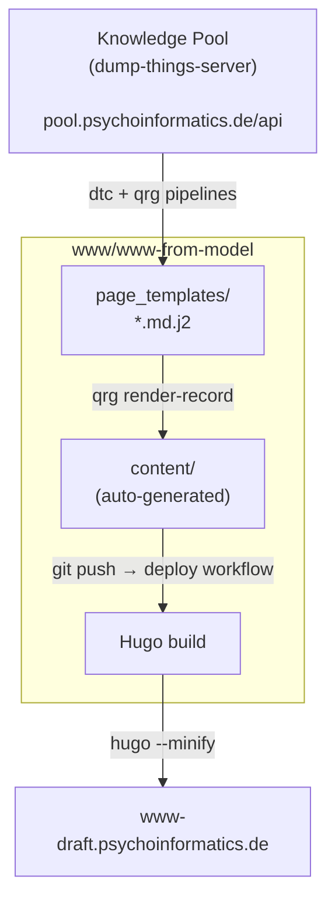
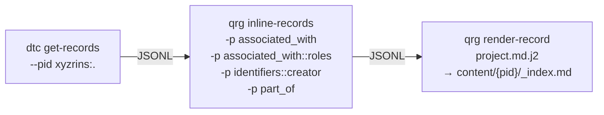
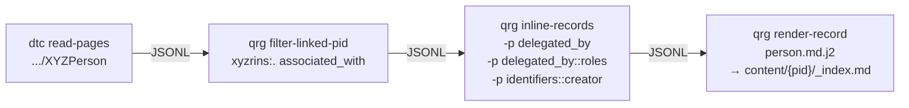
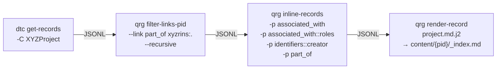
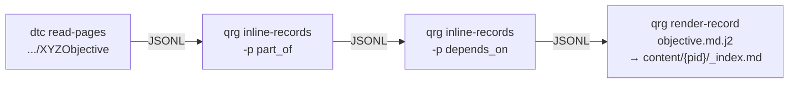
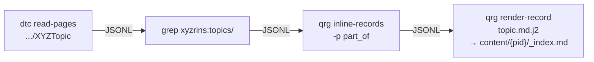
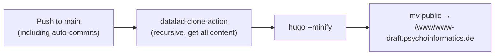
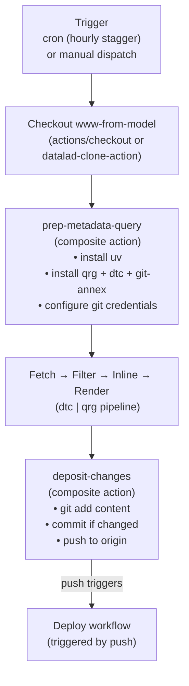

# Psychoinformatics Website-from-Model Workflows (historical snapshot)

> **Superseded by [`psychoinformatics-de.md`](psychoinformatics-de.md).**
> This document describes an **earlier state** of the
> [`www/www-from-model`](https://hub.psychoinformatics.de/www/www-from-model)
> pipeline: five per-class workflows using `qrg` (from
> `datalink/query-rse-group`), with depictions listed as "planned"
> and no navigation graph. The current pipeline is one consolidated
> workflow using `qri` (from `orinoco/query-things`), with
> depictions and the navigation graph implemented, and covers eight
> content classes (adding publications, instruments, datasets, and
> a root homepage record). See
> [`psychoinformatics-de.md`](psychoinformatics-de.md) for the
> current-state description. This file is kept for historical
> reference — do not rely on it as a description of the live system.

This document describes the automated Forgejo Actions workflows that
generate the entire content of the
[Psychoinformatics draft website](https://www-draft.psychoinformatics.de)
from a knowledge pool.
The workflows are defined in
[`.forgejo/workflows/`](https://hub.psychoinformatics.de/www/www-from-model/src/branch/main/.forgejo/workflows)
within the
[`www/www-from-model`](https://hub.psychoinformatics.de/www/www-from-model)
repository.

This is a **refactored, next-generation approach** compared to the
[TRR379 contributors-projects workflow](trr379-contributors-projects-workflow.md):
the entire website content is derived from the knowledge pool with
**no manual content edits** in the repository — only presentation
(layouts, styles) is maintained by hand.

## Overview

The key architectural differences from the TRR379 approach:

| Aspect | TRR379 | pim.de (www-from-model) |
|---|---|---|
| Scope | Contributors + projects only | Full website (frontpage, persons, projects, topics, objectives) |
| Rendering | Custom Python scripts (`person.py`, `project.py`) | Jinja2 templates via `qrg render-record` |
| Filtering | Custom Python filters + `qrg inline-records` | `qrg` filter commands + `qrg inline-records` |
| Extra data | ROR Parquet for site inference | None (all data from pool) |
| External code repo | `pool-publication-page` (cloned at runtime) | None — templates live in the website repo itself |
| Workflows | Single monolithic workflow | Five independent workflows (one per content type) + deploy |
| Manual content | Coexists with auto-generated | "No manual content edits" — content comes exclusively from metadata |
| Page output path | Hardcoded in Python scripts | Template-driven: `content/{__pid_curie_reference}/_index.md` |
| Hugo page files | `index.md` (leaf bundles) | `_index.md` (branch bundles — enables nesting) |
| Person metadata in front matter | Rich (name, projects, sites, roles, ORCID) | Minimal (`title` only); links in body |

### Note on person page metadata

The person pages currently use a minimal template that places only
the `title` (full name) in YAML front matter, with external profile
links rendered in the Markdown body. This contrasts with the TRR379
approach where `person.py` encodes projects, sites, roles, and ORCID
into structured front matter. It is possible that richer front matter
for persons is still forthcoming — the commented-out step in
[`update_person_pages.yaml`](https://hub.psychoinformatics.de/www/www-from-model/src/branch/main/.forgejo/workflows/update_person_pages.yaml)
references `pool-publication-page` code that "needs to be generalized"
before being used here, suggesting plans to add project-association
enrichment and similar processing.

The project pages, by contrast, already include a `persons` list in
front matter (extracted from `associated_with` relationships), plus
rendered people lists with roles in the body.

## Repositories and tools involved

| Repository / Tool | Role |
|---|---|
| [`www/www-from-model`](https://hub.psychoinformatics.de/www/www-from-model) | Hugo website source; target for generated pages; contains Jinja2 page templates |
| [`datalink/dump-things-pyclient`](https://hub.psychoinformatics.de/datalink/dump-things-pyclient) | Python client & CLI (`dtc`) for interacting with dump-things-server |
| [`datalink/query-rse-group`](https://hub.psychoinformatics.de/datalink/query-rse-group) | CLI tool (`qrg`) for inlining, filtering, and rendering research information records |
| [pool.psychoinformatics.de](https://pool.psychoinformatics.de) | dump-things-server instance (knowledge pool) |

> **Note on repository forks:** The `orinoco` org on
> hub.psychoinformatics.de hosts forks of both tools
> ([`orinoco/dump-things-pyclient`](https://hub.psychoinformatics.de/orinoco/dump-things-pyclient),
> [`orinoco/query-research-information`](https://hub.psychoinformatics.de/orinoco/query-research-information)).
> These install the same packages (`dump-things-pyclient` / `qrg`)
> and may appear in developer notes, but the canonical repos used
> by the workflows are under `datalink/`.

Unlike the TRR379 workflow, there is **no external code repository**
to clone — the Jinja2 templates in
[`page_templates/`](https://hub.psychoinformatics.de/www/www-from-model/src/branch/main/page_templates)
replace the custom Python formatters, and the `qrg` CLI provides
all needed filtering/inlining.

## CLI tools

### `dtc` (dump-things-pyclient)

- **`dtc read-pages`** — reads a paginated API endpoint and emits
  JSON Lines. Used for `XYZPerson`, `XYZObjective`, and `XYZTopic`.
- **`dtc get-records`** — retrieves records from a collection,
  optionally filtered by PID prefix (`--pid`) or class (`-C`). Used
  for the frontpage (`--pid xyzrins:.`) and projects (`-C XYZProject`).

### `qrg` (query-rse-group)

All four `qrg` subcommands are used across the workflows:

- **`qrg inline-records`** — resolves PID references by fetching
  referenced objects and embedding them inline. Supports multiple
  `-p` flags and `property::key` syntax (e.g.,
  `-p associated_with::roles` to inline roles nested within
  associations).
- **`qrg filter-linked-pid`** — filters records by checking whether
  their PID appears in a specified property of a reference record.
  Used to select persons associated with the `xyzrins:.` root.
- **`qrg filter-links-pid`** — filters records by checking whether
  they link to a target PID via a specified property.  Supports
  `--recursive` to follow chains of references.  Used to select
  projects that are (transitively) `part_of` the root.
- **`qrg render-record`** — renders each JSON record through a
  Jinja2 template and writes the output to a path derived from the
  record's PID.  The output filename template supports `{field}`
  interpolation; the special `{__pid_curie_reference}` variable
  holds the portion of the PID after the first colon.

## Composite actions

Two reusable composite actions in
[`.forgejo/actions/`](https://hub.psychoinformatics.de/www/www-from-model/src/branch/main/.forgejo/actions)
factor out common steps shared by all update workflows:

### `prep-metadata-query`

Sets up the environment for querying the knowledge pool:

1. Installs `uv` via `astral-sh/setup-uv@v6`
2. Installs `qrg` (with `dtc` and `git-annex` bundled via
   `--with-executables-from`) into a single `uv tool` environment
3. Configures Git identity and credential caching for pushing back
   to the repository

### `deposit-changes`

Commits and pushes generated content:

1. `git add content`
2. Checks for staged changes with `git diff --quiet --cached`
3. If changes exist: commits with message
   `"chore: auto-generate content from metadata"` and pushes to
   origin

## Jinja2 page templates

The [`page_templates/`](https://hub.psychoinformatics.de/www/www-from-model/src/branch/main/page_templates)
directory contains one template per content type:

| Template | Used by | Front matter | Body content |
|---|---|---|---|
| [`person.md.j2`](https://hub.psychoinformatics.de/www/www-from-model/src/branch/main/page_templates/person.md.j2) | `update_person_pages` | `title` (full name) | `description`, linked identifiers (GitHub, ORCID, LinkedIn, ResearchGate, Debian) |
| [`project.md.j2`](https://hub.psychoinformatics.de/www/www-from-model/src/branch/main/page_templates/project.md.j2) | `update_project_pages`, `update_frontpage` | `title`, `persons` list | `description`, parent project link, people with roles |
| [`objective.md.j2`](https://hub.psychoinformatics.de/www/www-from-model/src/branch/main/page_templates/objective.md.j2) | `update_objective_pages` | `title` | `part_of` links, `description` |
| [`topic.md.j2`](https://hub.psychoinformatics.de/www/www-from-model/src/branch/main/page_templates/topic.md.j2) | `update_topic_pages` | `title` (`display_label`) | `part_of` links, `description` |

All templates write to `content/{__pid_curie_reference}/_index.md`,
meaning the PID's CURIE reference (e.g., `persons/michael-hanke`)
directly determines the URL path on the generated site.

## Workflows

### Schedule overview

| Workflow | Cron (UTC, weekdays) | Record type | Pool endpoint |
|---|---|---|---|
| [`update_frontpage`](https://hub.psychoinformatics.de/www/www-from-model/src/branch/main/.forgejo/workflows/update_frontpage.yaml) | 01:00 | root (`xyzrins:.`) | `dtc get-records` |
| [`update_objective_pages`](https://hub.psychoinformatics.de/www/www-from-model/src/branch/main/.forgejo/workflows/update_objective_pages.yaml) | 02:00 | `XYZObjective` | `dtc read-pages` |
| [`update_person_pages`](https://hub.psychoinformatics.de/www/www-from-model/src/branch/main/.forgejo/workflows/update_person_pages.yaml) | 03:00 | `XYZPerson` | `dtc read-pages` |
| [`update_project_pages`](https://hub.psychoinformatics.de/www/www-from-model/src/branch/main/.forgejo/workflows/update_project_pages.yaml) | 04:00 | `XYZProject` | `dtc get-records` |
| [`update_topic_pages`](https://hub.psychoinformatics.de/www/www-from-model/src/branch/main/.forgejo/workflows/update_topic_pages.yaml) | 05:00 | `XYZTopic` | `dtc read-pages` |
| [`deploy`](https://hub.psychoinformatics.de/www/www-from-model/src/branch/main/.forgejo/workflows/deploy.yml) | on push to `main` | — | — |

All update workflows also support `workflow_dispatch` (manual trigger).
The deploy workflow triggers on every push to `main`, including the
auto-commits from the update workflows, so content updates flow
through to the live site automatically.

## Data flow

### High-level diagram



### Per-workflow pipelines

#### Frontpage (`update_frontpage`)



Fetches the root record (`xyzrins:.` — the Psychoinformatics group
itself), inlines its associations (persons with roles), identifiers
(with their creator orgs for display), and parent relationships, then
renders it using the project template to produce `content/_index.md`
(the Hugo homepage).

#### Person pages (`update_person_pages`)



1. **Fetch all persons** — `dtc read-pages .../XYZPerson`
2. **Filter to group members** — `qrg filter-linked-pid` checks the
   root record's `associated_with` property and keeps only persons
   whose PID appears there (i.e., people associated with `xyzrins:.`)
3. **Inline details** — resolves `delegated_by` (organizational
   delegations with roles) and `identifiers` (with their `creator`
   for platform names like "GitHub", "ORCID").
   Note: `-p delegated_by` is shorthand for `-p delegated_by::object`
   and is **not** redundant with the default blank-node inlining of
   `Delegation` records — while the `Delegation` itself is inlined
   automatically, its `object` field (an organization PID like
   `ror:02nv7yv05`) is only resolved if the pool has a matching
   record, and `-p delegated_by` triggers that lookup.
4. **Render** — produces `content/persons/<slug>/_index.md` with
   name, description, and identifier links

#### Project pages (`update_project_pages`)



1. **Fetch all projects** — `dtc get-records -C XYZProject`
2. **Filter to group projects** — `qrg filter-links-pid` keeps
   projects that are transitively `part_of` the root (`xyzrins:.`),
   following the `part_of` chain recursively
3. **Inline details** — resolves associations (persons with roles),
   identifiers, and parent projects
4. **Render** — produces `content/projects/<id>/_index.md` with
   title, person list in front matter, description, parent link,
   and people with roles

#### Objective pages (`update_objective_pages`)



1. **Fetch all objectives** — `dtc read-pages .../XYZObjective`
2. **Inline `part_of`** — resolves parent objective references
3. **Inline `depends_on`** — resolves dependency references
4. **Render** — produces `content/objectives/<id>/_index.md`

#### Topic pages (`update_topic_pages`)



1. **Fetch all topics** — `dtc read-pages .../XYZTopic`
2. **Filter by PID prefix** — a plain `grep 'xyzrins:topics/'`
   selects only topics under the `xyzrins:topics/` namespace
   (excluding topics from other namespaces)
3. **Inline `part_of`** — resolves parent topic references
4. **Render** — produces `content/topics/<slug>/_index.md`

### Deploy workflow



The deploy workflow runs on every push to `main` (and manual
dispatch). It uses
[`datalad-clone-action`](https://hub.datalad.org/forgejo/datalad-clone-action)
to check out the repository with all git-annex content, builds the
site with Hugo 0.146.0, and atomically swaps the built site into the
web server's document root.

## Workflow execution (common pattern)

Each update workflow follows the same structure:



## Environment

| Variable | Value |
|---|---|
| `POOLAPI` | `https://pool.psychoinformatics.de/api` |
| Runner | `debian-latest` |
| Deploy runner | `site-deploy` (with `/home/www/srv` volume) |
| Guard | Person pages: `forgejo.repository == 'www/www-from-model'` |

## Output structure

All generated content uses Hugo branch bundles (`_index.md`) rather
than leaf bundles (`index.md`), allowing nested content hierarchies:

```
content/
├── _index.md                          # frontpage (auto-generated)
├── persons/
│   ├── _index.md                      # (hand-maintained listing)
│   ├── michael-hanke/
│   │   └── _index.md                  # auto-generated
│   └── ...
├── projects/
│   ├── _index.md                      # (hand-maintained listing)
│   ├── datalad/
│   │   └── _index.md                  # auto-generated
│   └── ...
├── objectives/
│   ├── _index.md                      # (hand-maintained listing)
│   ├── self-hosted-it/
│   │   └── _index.md                  # auto-generated
│   └── ...
└── topics/
    ├── _index.md                      # (hand-maintained listing)
    ├── research-data-management/
    │   └── _index.md                  # auto-generated
    └── ...
```

The directory names are derived from PID CURIE references
(e.g., a record with PID `xyzrins:persons/michael-hanke` becomes
`content/persons/michael-hanke/_index.md`), so the URL structure of
the website directly mirrors the PID namespace of the knowledge pool.

## Planned / in-progress work

Based on the
[developer notes](https://hedgedoc.psychoinformatics.de/GbtN4IvTTLaGDUJN6rkU-A)
and commented-out workflow code:

### Person page enrichment

The `update_person_pages` workflow has a commented-out step that
would clone
[`pool-publication-page`](https://hub.trr379.de/q02/pool-publication-page)
for additional filtering (e.g., joining project associations,
inferring sites). The TODO notes that "that code needs to be
generalized before being used here, maybe also come from a more
central/generic repo." This would bring the person pages closer to
the TRR379 approach with richer front matter.

### Portrait images via `XYZDepiction`

The developer notes describe a planned feature to add portrait
images to person pages. The approach involves:

1. Querying `XYZDepiction` records from the pool
2. Filtering by depiction type (`Portrait` — PID
   `xyzrins:depiction-types/e9a34f7d-d05e-4591-bb45-f8a0c499e07b`)
3. Matching depictions to persons via the `about` field
4. Inlining `XYZFile` distribution records to extract download URLs
   (from `characterized_by` entries with
   `predicate == dcat:downloadUrl`)
5. Downloading images via git-annex-p2phttp URLs and placing them
   alongside the person page (e.g.,
   `content/persons/stephan-heunis/portrait.png`)
6. Updating the person template to render the image if it exists
   at the standard path

This may become a separate workflow or be integrated into
`update_person_pages`.

## References

- [Developer onboarding notes (HedgeDoc)](https://hedgedoc.psychoinformatics.de/GbtN4IvTTLaGDUJN6rkU-A)
  — Stephan Heunis's notes on local development, pipeline
  walkthrough with example records, and portrait image design
- [TRR379 workflow reference](trr379-contributors-projects-workflow.md)
  — the predecessor approach this work refactors
