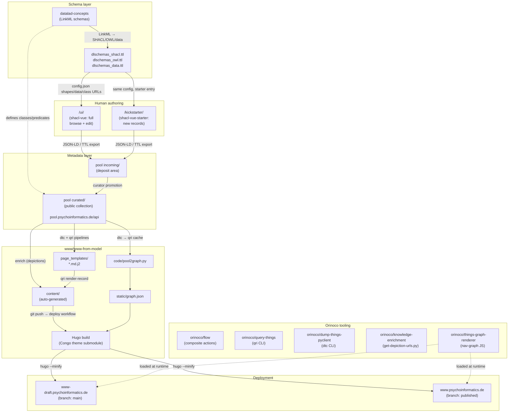
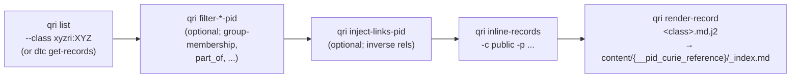
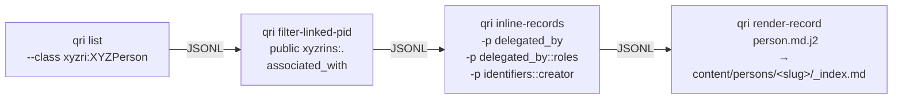
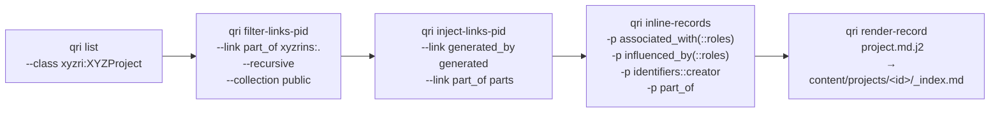
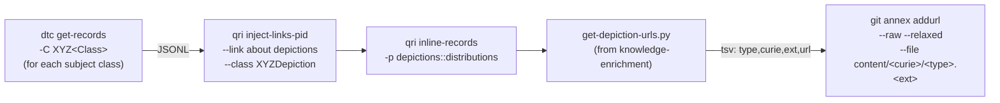
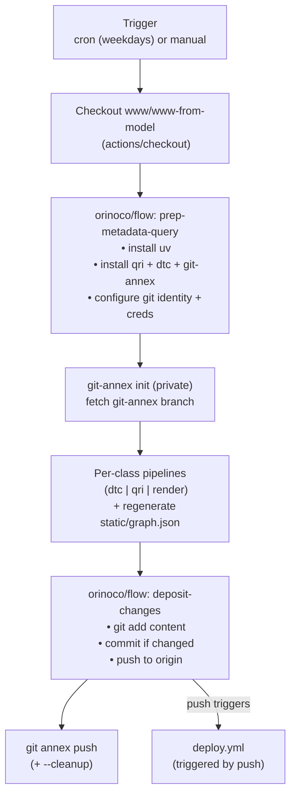

# Psychoinformatics Website-from-Model Workflow

This document describes the automated Forgejo Actions workflows that
generate the entire content of the
[Psychoinformatics group website](https://www.psychoinformatics.de)
(and its [draft mirror](https://www-draft.psychoinformatics.de))
from a knowledge pool.
The workflows are defined in
[`.forgejo/workflows/`](https://hub.psychoinformatics.de/www/www-from-model/src/branch/main/.forgejo/workflows)
within the
[`www/www-from-model`](https://hub.psychoinformatics.de/www/www-from-model)
repository.

> This supersedes the earlier
> [`pimde-www-from-model-workflow.md`](pimde-www-from-model-workflow.md),
> which described an intermediate state (five separate per-class
> workflows using `qrg` from `datalink/query-rse-group`, with
> depictions listed as "planned"). The current pipeline is
> **consolidated into a single workflow**, uses **`qri` from
> `orinoco/query-things`**, has **depictions implemented**, and
> covers **eight classes** (adding publications, instruments,
> datasets, and a root homepage record on top of persons/projects/
> objectives/topics).

## Overview

The workflow fetches structured metadata about the group and its
outputs from the [Psychoinformatics knowledge pool](https://pool.psychoinformatics.de)
(a [dump-things-server](https://hub.psychoinformatics.de/datalink/dump-things-server)
instance), transforms it through a pipeline of `qri` CLI commands
and Jinja2 templates, and writes the results as Hugo Markdown page
bundles into the website repository. Nothing under `content/` is
edited by hand — only presentation (`layouts/`, `page_templates/`,
theme submodule) is maintained manually.

The pipeline runs on weekday mornings (cron) and can be triggered
manually. On every push to `main` (or `published`) a separate deploy
workflow builds Hugo and swaps the site atomically.

## Human-facing entry points into the pool

Two web UIs are deployed alongside the pool API on
`pool.psychoinformatics.de`. Both are instances of the same
[`shacl-vue`](https://github.com/psychoinformatics-de/shacl-vue)
single-page app — a Vue/Vuetify frontend that reads SHACL shapes
(derived from the LinkML schemas) and renders form-based editors
for record classes. They share byte-identical `config.json`
(same shapes at `dlschemas_shacl.ttl`, same OWL classes at
`dlschemas_owl.ttl`, same seed data at `dlschemas_data.ttl`, same
prefix map, same class icons), and both bundles ship the same two
Vue entry components. They differ only in which entry component
the top-level `App` mounts:

| Path | Entry component | Role |
|---|---|---|
| [`/ui/`](https://pool.psychoinformatics.de/ui/) | `ShaclVue` (full) | Browse / query / list existing records loaded from `dlschemas_data.ttl` (controlled vocabularies + previously-authored records), pick a class, edit, follow SHACL-driven links between records, export JSON-LD / TTL |
| [`/kickstarter/`](https://pool.psychoinformatics.de/kickstarter/) | `ShaclVueStarter` (stripped-down) | Focused "start a new record from scratch" flow — a lightweight variant of the same app optimized for onboarding a new record without the browsing/list machinery. Supports DOI auto-fill (`DOIFetcher`) and JSON-LD / RDF import |

Both deployments are configured with `"use_service": false` and no
`service_base_url` — i.e., **neither UI talks to the pool's REST
API directly from the browser**. Users author a record in the UI,
export it as JSON-LD / TTL, and it gets deposited into the pool's
`incoming/` area separately (see the `/{collection}/incoming/…`
endpoints in the pool's [OpenAPI](https://pool.psychoinformatics.de/api/docs)).
From `incoming/` a curator promotes records into the `curated/`
area, and from there they show up in the `public` collection that
the `update-from-pool.yaml` workflow reads.

So the full life-cycle of a record is:

```
shacl-vue (/ui/ or /kickstarter/)
  → JSON-LD / TTL export
    → pool incoming/  (deposit)
      → pool curated/ (curator promotion)
        → pool public collection
          → dtc get-records | qri … | qri render-record
            → content/<curie>/_index.md
              → Hugo build
                → www[-draft].psychoinformatics.de
```

## Repositories and tools involved

| Repository / Tool | Role |
|---|---|
| [`www/www-from-model`](https://hub.psychoinformatics.de/www/www-from-model) | Hugo website source; target for generated pages; contains Jinja2 page templates and the `pool2graph.py` script |
| [`orinoco/flow`](https://hub.psychoinformatics.de/orinoco/flow) | "FLOW" toolkit — provides two composite Forgejo Actions (`prep-metadata-query`, `deposit-changes`) reused across sites |
| [`orinoco/query-things`](https://hub.psychoinformatics.de/orinoco/query-things) | CLI tool (`qri`) for filtering, inlining, and rendering research information records |
| [`orinoco/dump-things-pyclient`](https://hub.psychoinformatics.de/orinoco/dump-things-pyclient) | Python client & CLI (`dtc`) for interacting with dump-things-server |
| [`orinoco/knowledge-enrichment`](https://hub.psychoinformatics.de/orinoco/knowledge-enrichment) | Provides `tools/get-depiction-urls.py`, downloaded on demand by the depictions workflow |
| [`orinoco/things-graph-renderer`](https://hub.psychoinformatics.de/orinoco/things-graph-renderer) | JS blob loaded by the site to render the navigation graph from `static/graph.json` |
| [`psychoinformatics-de/datalad-concepts`](https://github.com/psychoinformatics-de/datalad-concepts) | LinkML schemas that define the record classes served by the pool (rendered at [concepts.datalad.org](https://concepts.datalad.org)) |
| [`psychoinformatics-de/shacl-vue`](https://github.com/psychoinformatics-de/shacl-vue) | Vue SPA rendering SHACL-driven form editors; deployed twice on the pool host: [`/ui/`](https://pool.psychoinformatics.de/ui/) (full browse+edit) and [`/kickstarter/`](https://pool.psychoinformatics.de/kickstarter/) (starter variant for new records) |
| [pool.psychoinformatics.de](https://pool.psychoinformatics.de) | dump-things-server instance (the knowledge pool) — hosts the REST API at `/api/`, the shacl-vue authoring UIs at `/ui/` and `/kickstarter/`, and the schema TTL bundles they load |

The Jinja2 templates in
[`page_templates/`](https://hub.psychoinformatics.de/www/www-from-model/src/branch/main/page_templates)
live directly in the website repo — there is no external
`pool-publication-page`-like repository to clone at build time.

## CLI tools

### `dtc` (dump-things-pyclient)

- **`dtc get-records`** — retrieves records from a collection,
  optionally filtered by class (`-C`) or PID prefix. Used for all
  content updates in the current workflow.

### `qri` (query-things)

- **`qri list`** — lists records of a given class or under a given
  PID from a pool collection.
- **`qri cache`** — caches records locally to avoid redundant API
  calls (uses `QRI_RECORD_CACHE=/tmp/qri-cache`).
- **`qri filter-linked-pid`** — filters records by checking whether
  their PID appears in a specified property of a reference record.
  Used to select persons whose PIDs appear in the root record's
  `associated_with` property.
- **`qri filter-links-pid`** — filters records by checking whether
  they link to a target PID via a specified property. Supports
  `--recursive` to follow chains of references. Used to select
  projects transitively `part_of` the group root.
- **`qri inject-links-pid`** — the inverse of `filter-links-pid`:
  materializes back-references as a new property on each record.
  Used to add `generated` (inverse of `generated_by`) and `parts`
  (inverse of `part_of`) on project and homepage records.
- **`qri inline-records`** — resolves PID references by fetching
  referenced objects and embedding them inline. Supports multiple
  `-p` flags and `property::key` syntax (e.g.,
  `-p associated_with::roles` to inline roles nested within
  associations).
- **`qri render-record`** — renders each JSON record through a
  Jinja2 template and writes the output to a path derived from the
  record's PID. The output filename template supports `{field}`
  interpolation; the special `{__pid_curie_reference}` variable
  holds the portion of the PID after the first colon.

## Composite actions (from `orinoco/flow`)

Two reusable composite actions factor out common steps shared by
the update workflows. They are referenced remotely as
`https://hub.psychoinformatics.de/orinoco/flow/forgejo/actions/<name>@main`.

### `prep-metadata-query`

Sets up the environment for querying the knowledge pool
([source](https://hub.psychoinformatics.de/orinoco/flow/src/branch/main/forgejo/actions/prep-metadata-query/action.yml)):

1. Installs `uv` via `astral-sh/setup-uv@v6`
2. Installs `qri` (with `dtc` and `git-annex` bundled via
   `--with-executables-from`) into a single `uv tool` environment
3. Configures Git identity (`Forgejo Actions <actor@server>`) and
   credential caching for pushing back to the repository

### `deposit-changes`

Commits and pushes generated content
([source](https://hub.psychoinformatics.de/orinoco/flow/src/branch/main/forgejo/actions/deposit-changes/action.yml)):

1. `git add content`
2. Checks for staged changes with `git diff --quiet --cached`
3. If changes exist: commits with message
   `"chore: auto-generate content from metadata"` and pushes to
   origin

## Jinja2 page templates

The [`page_templates/`](https://hub.psychoinformatics.de/www/www-from-model/src/branch/main/page_templates)
directory contains one template per content type, all extending a
shared `page.md.j2` base that provides taxonomy-terms macros,
association-period formatting, and URL-override handling:

| Template | Content type | Notes |
|---|---|---|
| [`homepage.md.j2`](https://hub.psychoinformatics.de/www/www-from-model/src/branch/main/page_templates/homepage.md.j2) | Root (`xyzrins:.`) | Renders `content/_index.md`; enumerates projects, objectives, persons, instruments as taxonomies |
| [`person.md.j2`](https://hub.psychoinformatics.de/www/www-from-model/src/branch/main/page_templates/person.md.j2) | `XYZPerson` | Minimal front matter: `title`, `given_name`, `family_name`, `identifiers`, `description` |
| [`project.md.j2`](https://hub.psychoinformatics.de/www/www-from-model/src/branch/main/page_templates/project.md.j2) | `XYZProject` | Front-matter taxonomies for projects/objectives/persons/instruments; body has parent link, objectives, current/former people with roles |
| [`objective.md.j2`](https://hub.psychoinformatics.de/www/www-from-model/src/branch/main/page_templates/objective.md.j2) | `XYZObjective` | `part_of` and `depends_on` in body |
| [`topic.md.j2`](https://hub.psychoinformatics.de/www/www-from-model/src/branch/main/page_templates/topic.md.j2) | `XYZTopic` | Uses `display_label` for `title`; `part_of` in body |
| [`publication.md.j2`](https://hub.psychoinformatics.de/www/www-from-model/src/branch/main/page_templates/publication.md.j2) | `XYZPublication` | Extracts DOI from `identifiers`, authors from `attributed_to`, `about` topics |
| [`instrument.md.j2`](https://hub.psychoinformatics.de/www/www-from-model/src/branch/main/page_templates/instrument.md.j2) | `XYZInstrument` | Similar structure to dataset; extracts DOI and source-code URL (`obo:APOLLO_SV_00000488`) |
| [`dataset.md.j2`](https://hub.psychoinformatics.de/www/www-from-model/src/branch/main/page_templates/dataset.md.j2) | `XYZDataset` | Extracts DOI, generation time, source code; renders `about`/`characterized_by` |

All templates write to `content/{__pid_curie_reference}/_index.md`,
meaning the PID's CURIE reference (e.g., `persons/michael-hanke`)
directly determines the URL path on the generated site. All
generated files use Hugo **branch bundles** (`_index.md`) rather
than leaf bundles (`index.md`), allowing nested content hierarchies.

## Workflows

### Schedule overview

| Workflow | Trigger | Purpose |
|---|---|---|
| [`update-from-pool.yaml`](https://hub.psychoinformatics.de/www/www-from-model/src/branch/main/.forgejo/workflows/update-from-pool.yaml) | cron: weekdays 01:00 UTC + manual | Rebuild `content/` for every class + `static/graph.json` |
| [`register-depictions.yaml`](https://hub.psychoinformatics.de/www/www-from-model/src/branch/main/.forgejo/workflows/register-depictions.yaml) | cron: weekdays 03:00 UTC + manual | Register depiction images as git-annex keys under `content/<curie>/<type>.<ext>` |
| [`deploy.yml`](https://hub.psychoinformatics.de/www/www-from-model/src/branch/main/.forgejo/workflows/deploy.yml) | on push to `main` or `published` + manual | Hugo build and atomic deploy |

Both update workflows are guarded by
`forgejo.repository == 'www/www-from-model'` so they don't run in
forks. The deploy workflow triggers on every push to the tracked
branches (including auto-commits from the update workflows), so
content updates flow through to the live sites automatically.

### `update-from-pool.yaml` — full content refresh

A single workflow runs one step per class. Each step follows the
same shape:

```
qri list --class xyzri:XYZ<Class>           # or dtc get-records / qri list --pid ...
  | qri filter-*  ...                       # optional
  | qri inject-links-pid ...                # optional
  | qri inline-records -c public -p ...     # one or more -p flags
  | qri render-record page_templates/<class>.md.j2 \
        'content/{__pid_curie_reference}/_index.md'
```

Per-class specifics:

| Step | Selection | Inlined properties | Template |
|---|---|---|---|
| Objectives | `qri list --class xyzri:XYZObjective` | `part_of`, `depends_on` | `objective.md.j2` |
| Topics | `qri list --class xyzri:XYZTopic` | `part_of` | `topic.md.j2` |
| Persons | `qri list --class xyzri:XYZPerson` filtered via `qri filter-linked-pid public xyzrins:. associated_with` (keeps only group members) | `delegated_by`, `delegated_by::roles`, `identifiers::creator` | `person.md.j2` |
| Projects | `qri list --class xyzri:XYZProject` filtered via `qri filter-links-pid --link part_of xyzrins:. --recursive --collection public`; then `qri inject-links-pid --link generated_by generated` and `--link part_of parts` | `associated_with`, `associated_with::roles`, `influenced_by`, `influenced_by::roles`, `identifiers::creator`, `part_of` | `project.md.j2` |
| Publications | `qri list --class xyzri:XYZPublication` | `about`, `attributed_to` | `publication.md.j2` |
| Instruments | `qri list --class xyzri:XYZInstrument` | `about`, `attributed_to`, `kind`, `rules` | `instrument.md.j2` |
| Datasets | `qri list --class xyzri:XYZDataset` | `about`, `attributed_to`, `kind`, `rules`, `characterized_by` | `dataset.md.j2` |
| Frontpage (homepage) | `qri list --pid xyzrins:.` → same injects as projects | same as projects | `homepage.md.j2` |

Additionally, before the per-class steps, the workflow regenerates
the navigation graph via a small local Python script:

```text
dtc get-records ${DUMPTHINGS_APIURL} public
  | qri cache
  | python3 code/pool2graph.py > static/graph.json
```

[`code/pool2graph.py`](https://hub.psychoinformatics.de/www/www-from-model/src/branch/main/code/pool2graph.py)
selects which node and edge types show up in the navigation graph via
two top-of-file dicts:

- `wanted_node_types` — 8 classes: `XYZInstrument`, `XYZOrganization`,
  `XYZPerson`, `XYZProject`, `XYZPublication`, `XYZTopic`,
  `XYZObjective`, `XYZDataset`.
- `wanted_edge_types` — 7 predicates: `associated_with`,
  `attributed_to`, `generated_by`, `delegated_by`, `influenced_by`,
  `part_of`, `about`.

At the end, `deposit-changes` commits `content/`, and
`git annex push` (+ `--cleanup`) publishes any new annexed content
(including graph updates) to the annex remotes.

### `register-depictions.yaml` — image registration

For each subject class the workflow fetches records, injects the
`about → depictions` link with `--class XYZDepiction`, inlines
`depictions::distributions`, then a helper (fetched on demand from
[`orinoco/knowledge-enrichment`](https://hub.psychoinformatics.de/orinoco/knowledge-enrichment))
emits `<type>\t<curie>\t<ext>\t<url>` lines. Each line becomes a
git-annex key registered via
`git annex addurl --raw --relaxed --file=<target> <url>`:

```
content/<curie>/<depiction_type>.<ext>
```

where `<depiction_type>` is `portrait`, `logo`, `depiction`, etc.,
matching the `depiction_type` option per taxonomy in
`content/<taxonomy>/_index.md` (e.g., `persons/_index.md` sets
`depiction_type: portrait`).

> **Observed issue.** As of the last inspection,
> `register-depictions.yaml` references the composite actions via
> **local** paths (`./.forgejo/actions/prep-metadata-query`,
> `./.forgejo/actions/deposit-changes`) that do not exist in the
> checkout, while `update-from-pool.yaml` correctly uses the
> remote `orinoco/flow` references. The depiction workflow will
> fail until either a `.forgejo/actions/` directory is added or
> the paths are switched to the remote form.

### `deploy.yml` — Hugo build & atomic swap

1. Checks out the repo, `git submodule update --init --depth 1
   themes/congo`.
2. `git annex init` (private) and `git annex get .` to materialize
   annexed content and depictions.
3. Sets up Hugo 0.154.5 extended.
4. `hugo --minify`.
5. Deploy target depends on the branch (writes into the
   `site-deploy` runner's mounted `/home/www/srv`):
   - `main` → `www-draft.psychoinformatics.de`
   - `published` → `www.psychoinformatics.de`

## Data flow

### High-level diagram



### Per-class pipeline pattern

Every content-generating step in `update-from-pool.yaml` fits this
template:



### Persons pipeline (concrete example)



### Projects pipeline (concrete example)



### Depictions pipeline



## Workflow execution (common pattern)



## Environment

| Variable | Value |
|---|---|
| `DUMPTHINGS_APIURL` | `https://pool.psychoinformatics.de/api` |
| `QRI_RECORD_CACHE` | `/tmp/qri-cache` (for `qri cache`) |
| Update runner | `debian-latest` |
| Deploy runner | `site-deploy` (mounts `/home/www/srv:/www:rw`) |
| Repo guard | `forgejo.repository == 'www/www-from-model'` |

## Output structure

```
content/
├── _index.md                          # frontpage (auto-generated, from xyzrins:.)
├── contact.md                         # (hand-maintained)
├── explore.md                         # (hand-maintained; loads graph.json)
├── outputs.md                         # (hand-maintained)
├── persons/
│   ├── _index.md                      # (hand-maintained listing;
│   │                                  #  configures depiction_type: portrait)
│   ├── michael-hanke/
│   │   ├── _index.md                  # auto-generated
│   │   └── portrait.jpg               # git-annex key registered by
│   │                                  # register-depictions.yaml
│   └── ...
├── projects/
│   ├── _index.md                      # (hand-maintained listing)
│   ├── datalad/
│   │   ├── _index.md                  # auto-generated
│   │   └── logo.png                   # depiction (git-annex key)
│   └── ...
├── objectives/
├── topics/
├── publications/
├── instruments/
└── datasets/
```

The URL structure of the website directly mirrors the PID
namespace of the knowledge pool (a record with PID
`xyzrins:persons/michael-hanke` becomes
`content/persons/michael-hanke/_index.md` → `/persons/michael-hanke/`).

## Relation to prior TRR379 work

This pipeline is a **third-generation refactor** of the pattern
first prototyped for the TRR379 consortium page
([reference](trr379-contributors-projects-workflow.md)). The
evolution:

| Aspect | TRR379 (v1) | Earlier pim.de (v2, in `pimde-*` doc) | Current pim.de (v3, here) |
|---|---|---|---|
| Scope | Contributors + projects only | Frontpage + persons + projects + topics + objectives | All of v2 **plus** publications, instruments, datasets, depictions, and a navigation graph |
| Rendering | Custom Python scripts (`person.py`, `project.py`) | Jinja2 templates via `qrg render-record` | Jinja2 templates via `qri render-record` (single shared `page.md.j2` base) |
| Filter/transform CLI | `qrg` (`query-rse-group`) + custom Python filters (`join-association.py`, `infer-site.py`) | `qrg` filter/inline commands | `qri` (`query-things`); adds `inject-links-pid` for materializing inverse relations |
| External code repo | `q02/pool-publication-page` cloned at runtime | None — templates in the website repo | None — templates in the website repo; helper scripts fetched ad hoc (`get-depiction-urls.py`) |
| Extra data sources | ROR Parquet for site inference | None | None (all from pool; ROR/geodata prefixes handled in the schema) |
| Workflow layout | Single monolithic workflow | Five workflows (one per class) + deploy | One consolidated `update-from-pool.yaml` (one step per class) + `register-depictions.yaml` + deploy |
| Composite actions | Inline in the monolithic workflow | Local `./.forgejo/actions/` | Remote from `orinoco/flow` (shared across sites) |
| Manual content | Coexists with auto-generated | "No manual content edits" — content comes only from metadata | Same policy; a few hand-maintained pages (`contact.md`, `explore.md`, `outputs.md`, taxonomy `_index.md`) remain but describe presentation, not records |
| Person front matter | Rich (name, projects, sites, roles, ORCID) | Minimal (`title` only); links in body | Slightly richer (`given_name`, `family_name`, `identifiers`, `description`); still no project-association enrichment |
| Depictions | Not implemented | Listed as "planned" | **Implemented** as a separate scheduled workflow, storing images as git-annex keys named by depiction type |
| Navigation graph | Not present | Not present | **Implemented** — `pool2graph.py` produces `static/graph.json`, rendered client-side by `things-graph-renderer` JS |
| Page bundle style | Leaf (`index.md`) | Branch (`_index.md`) | Branch (`_index.md`) |

Two properties carry over unchanged from TRR379:

- **PID CURIE → URL path** — a record with PID
  `<prefix>:<taxonomy>/<slug>` becomes
  `content/<taxonomy>/<slug>/…`, giving the URL structure of the
  site the same shape as the pool's PID namespace.
- **Idempotent deposit** — the update job only commits if
  `git diff --quiet --cached` finds staged changes; identical
  regenerations produce no commit.

The direction of travel across the three generations has been:
**fewer bespoke scripts, more schema-driven configuration, and
composite actions shared across sites** (via `orinoco/flow`) so that
new sites can adopt the pattern without reinventing the plumbing.

## References

- [`www/www-from-model`](https://hub.psychoinformatics.de/www/www-from-model)
  — the website source repo (schema-driven Hugo build)
- [`orinoco/flow`](https://hub.psychoinformatics.de/orinoco/flow)
  — composite Forgejo Actions reused across sites
- [`orinoco/query-things`](https://hub.psychoinformatics.de/orinoco/query-things)
  — the `qri` CLI toolkit
- [`orinoco/dump-things-pyclient`](https://hub.psychoinformatics.de/orinoco/dump-things-pyclient)
  — the `dtc` CLI
- [`orinoco/knowledge-enrichment`](https://hub.psychoinformatics.de/orinoco/knowledge-enrichment)
  — supplies `get-depiction-urls.py`
- [`orinoco/things-graph-renderer`](https://hub.psychoinformatics.de/orinoco/things-graph-renderer)
  — client-side navigation-graph renderer
- [`psychoinformatics-de/datalad-concepts`](https://github.com/psychoinformatics-de/datalad-concepts)
  — LinkML schemas; rendered docs at
  [`concepts.datalad.org`](https://concepts.datalad.org)
- [`psychoinformatics-de/shacl-vue`](https://github.com/psychoinformatics-de/shacl-vue)
  — Vue SPA rendering SHACL-driven form editors; deployed at
  [`pool.psychoinformatics.de/ui/`](https://pool.psychoinformatics.de/ui/)
  (full browse+edit) and
  [`pool.psychoinformatics.de/kickstarter/`](https://pool.psychoinformatics.de/kickstarter/)
  (starter variant for authoring new records). Both share the same
  bundle and `config.json`; the deployments differ only in whether
  the `App` component mounts `ShaclVue` (full) or
  `ShaclVueStarter` (stripped-down)
- [Developer onboarding notes (HedgeDoc)](https://hedgedoc.psychoinformatics.de/GbtN4IvTTLaGDUJN6rkU-A)
  — Stephan Heunis's notes on local development and pipeline
  walkthrough (references the earlier v2 layout)
- [TRR379 workflow reference](trr379-contributors-projects-workflow.md)
  — the v1 predecessor
- [Earlier v2 snapshot](pimde-www-from-model-workflow.md)
  — kept as a historical reference
