# Metadata site delivery and editing plan

## Objective

Build the Center for Open Neuroscience website as a set of views over validated
research metadata, rather than as a manually maintained collection of pages. The
canonical repository representation remains the existing
[DataLad Concepts Things v2 schema](https://concepts.datalad.org/s/things/v2/)
used by the pre-existing effort. Source adapters, assisted reconciliation, and
site presentation are replaceable layers around those records. Compatibility
with the Psychoinformatics implementation means using its data-model and
projection approach; it does not mean importing that site's branding or
content.

The repository remains pure Git for now. Pixi provides the reproducible tool
environment; DataLad can be introduced later if data size or provenance needs
justify it.

## End-to-end flow

```mermaid
flowchart LR
    A[Source APIs and snapshots] --> B[Deterministic adapters]
    B --> C[Candidate Things v2 records]
    C --> D[Reconciliation report]
    D --> E[Agent and human review]
    E --> F[Source-scoped JSON arrays]
    F --> G[Orinoco validation]
    G --> H[Deterministic merge and site build]
    H --> I[GitHub Actions artifact]
    I --> J[Main site or pull request preview]
```

The important boundary is between candidates and promoted records. Programs
should handle repeatable extraction and normalization. Agents and people should
resolve identity, ambiguous relationships, source conflicts, and missing
context. Every promoted array must pass the same Orinoco validation as the
existing upstream JSON.

## Current implementation

- `data/pool/` retains the pre-existing shared records.
- `data/con_site/` represents records obtained from the current CON site.
- `data/zotero_centerforopenneuroscience/` contains promoted records from the
  CON Zotero group.
- `inputs/zotero_centerforopenneuroscience/` retains the source snapshot,
  candidates, and reconciliation evidence needed to repeat or review ingestion.
- `scripts/validate_records.py` validates any source-scoped arrays through the
  current Orinoco `dump-things-service`.
- `scripts/build_site.py` merges records by Things v2 class and persistent
  identifier, reports scalar disagreements, and generates the public site.
- `site/` contains presentation templates and static assets only. It does not
  contain canonical research information.

The initial site build produces browseable and searchable pages for people,
organizations, projects, grants, publications, datasets, and instruments. It
also exposes backlinks between modeled entities and a machine-readable merged
record export.

## Source and conflict policy

Records retain source identity through their enclosing `data/<source>/`
directory. The site build never edits those source records. It groups records by
class and PID, unions set-like fields, selects scalar values according to an
explicit source precedence, and writes every scalar disagreement to
`build/site-merge-report.json`.

Current precedence is deliberately conservative:

- `con_site` is preferred for most center-specific descriptive fields.
- Zotero is preferred for publication and dataset bibliographic fields.
- `pool` is preferred for publication venue identity.

This is an initial policy, not a claim that one source is universally
authoritative. Field-level policy can replace class-level precedence once the
conflict report has been reviewed.

`site/merge-policy.yaml` enumerates the current set of non-empty scalar
disagreements for the same class, PID, and field. CI fails when a new
disagreement lacks a reviewed decision or when a decision becomes stale. This
fail-closed rule is deliberately narrow: it does not claim that all content,
identity, relationship, or editorial decisions are complete.

## Continuous integration and publishing

The `Site CI` workflow runs for every pull request and every push to `main`:

1. Install Pixi `0.66.0` from the committed lock file.
2. Start a local Orinoco validation service.
3. Validate every JSON record under `data/`.
4. Build the site with the URL prefix appropriate to main or the pull request.
5. Upload the generated site and merge report as workflow artifacts.

For pull requests, publication is intentionally split into a second
`workflow_run` workflow. The pull request receives only read permissions and
cannot access a deployment token. After it succeeds, a workflow stored on the
trusted default branch downloads the static artifact, checks size and symlink
boundaries, and publishes it under `pr-preview/pr-<number>/`. It never checks out
or executes code from the pull request. A `pull_request_target` workflow removes
that directory when the pull request closes, likewise without checking out pull
request code.

Pushes to `main` deploy the root site to `gh-pages` while preserving the
`pr-preview/` directory. Third-party actions in write-enabled jobs are pinned to
immutable commit hashes.

### One-time upstream repository setup

1. Merge the preview deployment and cleanup workflow files into the default
   branch. GitHub only runs a `workflow_run` workflow when that workflow already
   exists on the default branch, so the pull request that introduces it cannot
   publish its own upstream preview.
2. Permit GitHub Actions workflows to request `contents: write` permission.
3. Run `Site CI` on `main` once so that it creates the `gh-pages` branch.
4. In repository Pages settings, select **Deploy from a branch**, choose
   `gh-pages`, and choose the branch root.
5. Confirm the default project URL before adding a custom domain. The generated
   links initially assume `/<repository-name>/`.

The default expected locations are:

- Main: `https://con.github.io/dump-research-info/`
- Pull request: `https://con.github.io/dump-research-info/pr-preview/pr-<number>/`

A custom domain requires a follow-up decision because its root path differs
from a GitHub project site. The build already accepts `--base-path`, so this is a
deployment configuration change rather than a data-model change.

## Maintenance cycle

1. Refresh a source snapshot using its adapter.
2. Regenerate candidates and a reconciliation report without modifying promoted
   records.
3. Review new identities, duplicate PIDs, unresolved links, and scalar
   disagreements. Agents may propose mappings, but stable identifiers and
   relationship claims should remain visible for human review.
4. Promote accepted records into the source-scoped Things v2 arrays.
5. Run `pixi run validate-data` with the local validation service available.
6. Build and inspect the merge report with `pixi run site-build`.
7. Open a pull request and use its generated preview to review both metadata and
   presentation.

The Zotero group can be refreshed on this cadence without changing the site
templates. New Zotero items require a reviewed addition record before the write
command can apply them. Additional adapters for ORCID, ROR, Crossref, OpenAlex,
GitHub, or institutional sources should eventually follow the same
snapshot/candidate/reconciliation/promotion contract and respect source API
terms.

Before generalizing those adapters, agent and human research should map the
available sources, identifiers, evidence quality, and unknowns. This avoids
prematurely forcing heterogeneous funder, project, publication, and dataset
sources through one extraction design.

## SHACL-vue boundary

[SHACL-vue](https://hub.psychoinformatics.de/orinoco/shacl-vue) is the proposed
editing surface for the same Things v2 model. Adding an editor to the static
public build would blur an important security and ownership boundary. A useful
deployment needs at least:

- an annotated SHACL shapes graph;
- an OWL class hierarchy;
- an RDF projection of the current Things v2 data graph;
- editor component configuration;
- authentication and authorization;
- a write API with validation, provenance, and conflict behavior; and
- a defined round trip from RDF edits to source-scoped canonical JSON.

The recommended sequence is to keep the public site read-only, prove the
ingestion and preview workflow, then prototype SHACL-vue as a separate editor
against a disposable branch or staging repository. The RDF graph is a
serialization of Things v2, not an alternative backing model. Accepted edits
should arrive as reviewable Git changes rather than mutating the generated
merged view.

## Coverage work still required

- Audit every page and reusable fact on the current live CON site against the
  modeled records, including historical and narrative content.
- Resolve Zotero creator identities to `XYZPerson` records where reliable.
- Resolve publication topics and venues that do not yet map to stable records.
- Add source adapters and reconciliation rules for information absent from the
  current site and Zotero.
- Decide how long-form narrative, navigation labels, and editorial ordering are
  modeled without weakening compatibility with Things v2.
- Define accessibility, redirect, analytics, and search-engine requirements
  before replacing the live domain.

## Open decisions

1. Who can enable repository Pages and grant the required workflow permissions?
2. Which source is authoritative for each scalar field where the current merge
   report identifies a disagreement?
3. Should agent-proposed identity mappings live in a reviewed mapping file, or
   should accepted links be written directly into promoted records?
4. Which current-site narrative sections need first-class modeled entities, and
   which can remain version-controlled editorial content?
5. What authentication provider and review policy should the SHACL-vue
   editor use?

## References

- [CON metadata-driven website issue](https://github.com/con/dump-research-info/issues/18)
- [TRR379 contributors and projects workflow](https://github.com/con/dump-research-info/blob/HEAD/docs/references/trr379-contributors-projects-workflow.md)
- [Orinoco Flow](https://hub.psychoinformatics.de/orinoco/flow)
- [Orinoco dump-things-server](https://hub.psychoinformatics.de/orinoco/dump-things-server)
- [DataLad Concepts demo research-information schema](https://concepts.datalad.org/s/demo-research-information/unreleased/)
- [DataLad Concepts Things v2 schema](https://concepts.datalad.org/s/things/v2/)
- [Psychoinformatics metadata-driven site](https://www.psychoinformatics.de/)
- [CON Zotero group](https://www.zotero.org/groups/6197458/centerforopenneuroscience/library)
- [VisiData psychoinformatics demonstration](https://github.com/con/visidata-demos/tree/master/psychoinformatics-1)
- [GitHub `workflow_run` documentation](https://docs.github.com/actions/using-workflows/events-that-trigger-workflows#workflow_run)
- [GitHub Pages deployment action](https://github.com/JamesIves/github-pages-deploy-action)
- [Pull request preview action](https://github.com/rossjrw/pr-preview-action)
