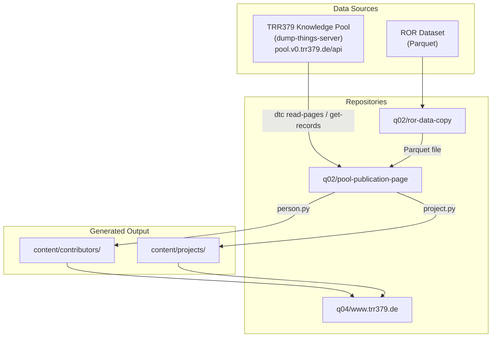
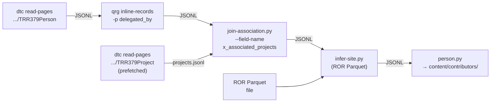
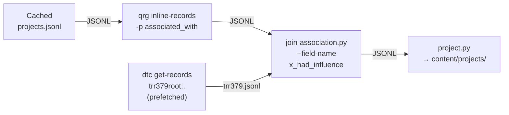
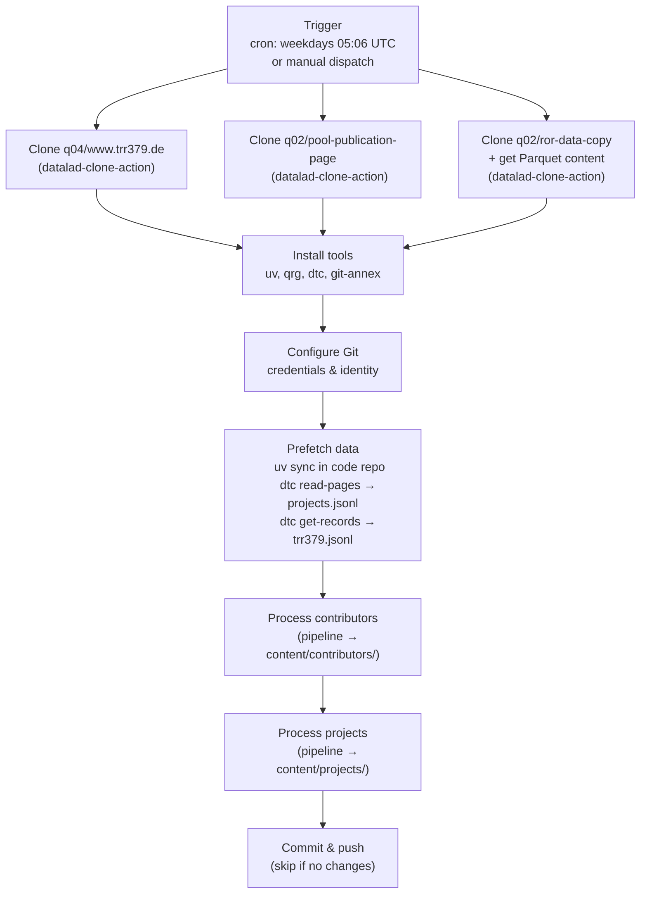

# TRR379 Contributors & Projects Workflow

This document describes the automated Forgejo Actions workflow that
generates contributor and project pages for the
[TRR379 website](https://www.trr379.de).
The workflow is defined in
[`.forgejo/workflows/contributors-projects.yml`](https://hub.trr379.de/q04/www.trr379.de/src/branch/main/.forgejo/workflows/contributors-projects.yml)
within the
[`q04/www.trr379.de`](https://hub.trr379.de/q04/www.trr379.de)
repository.

## Overview

The workflow fetches structured metadata about people and projects
from the TRR379 knowledge pool (a
[dump-things-server](https://hub.psychoinformatics.de/datalink/dump-things-server)
instance), transforms it through a pipeline of CLI tools and Python
filters, and writes the results as Hugo Markdown page bundles into
the website repository. It runs on weekday mornings (cron) and can
be triggered manually.

## Repositories involved

| Repository | Role |
|---|---|
| [`q04/www.trr379.de`](https://hub.trr379.de/q04/www.trr379.de) | Hugo website source; target for generated pages |
| [`q02/pool-publication-page`](https://hub.trr379.de/q02/pool-publication-page) | Python formatters and filters that transform pool records into Hugo Markdown |
| [`q02/ror-data-copy`](https://hub.trr379.de/q02/ror-data-copy) | Copy of the [ROR](https://ror.org/) dataset in Parquet format, used for inferring institutional affiliations |
| [`datalink/dump-things-pyclient`](https://hub.psychoinformatics.de/datalink/dump-things-pyclient) | Python client & CLI (`dtc`) for interacting with dump-things-server |
| [`datalink/query-rse-group`](https://hub.psychoinformatics.de/datalink/query-rse-group) | CLI tool (`qrg`) with commands for inlining and filtering research information records |
| [`forgejo/datalad-clone-action`](https://hub.datalad.org/forgejo/datalad-clone-action) | Forgejo Action for cloning DataLad datasets (used instead of a plain checkout) |

## CLI tools

### `dtc` (dump-things-pyclient)

Client for the dump-things-server REST API. The workflow uses two
subcommands:

- **`dtc read-pages`** — reads a paginated API endpoint and emits
  JSON Lines to stdout. Used to fetch `TRR379Person` and
  `TRR379Project` records from the pool.
- **`dtc get-records`** — retrieves records from a collection,
  filtered by PID prefix. Used to fetch all records under the
  `trr379root:.` namespace.

### `qrg` (query-rse-group)

Query and transformation toolkit for research information records.
The workflow uses one subcommand:

- **`qrg inline-records`** — resolves PID references within records
  by fetching the referenced objects from the pool API and embedding
  them inline. Accepts `--api-url`, `-c` (collection), and
  `-p` (property) flags. Caches fetched records to avoid redundant
  API calls.

## Filters and formatters (pool-publication-page)

The [`pool-publication-page`](https://hub.trr379.de/q02/pool-publication-page)
repository contains two categories of scripts:

### Formatters (top-level scripts)

These read enriched JSON Lines from stdin and write Hugo Markdown
page bundles to a target directory:

- [`person.py`](https://hub.trr379.de/q02/pool-publication-page/src/branch/main/person.py)
  — generates contributor pages under `content/contributors/<slug>/index.md`
  with front matter containing name, projects, sites, roles, ORCID,
  and affiliation.
- [`project.py`](https://hub.trr379.de/q02/pool-publication-page/src/branch/main/project.py)
  — generates project pages under `content/projects/<id>/index.md`
  with front matter containing title, contributors, sites, topics,
  and roles. Also updates German translations (`index.de.md`).

### Filters (`filters/` directory)

These read JSON Lines on stdin, enrich or transform the records, and
write JSON Lines on stdout:

- [`join-association.py`](https://hub.trr379.de/q02/pool-publication-page/src/branch/main/filters/join-association.py)
  — performs a join-like operation between two sets of records via an
  association property, creating inverse relationships.
  Flags: `--inline`, `--pop`, `--field-name`.
- [`infer-site.py`](https://hub.trr379.de/q02/pool-publication-page/src/branch/main/filters/infer-site.py)
  — matches organizational affiliations against known TRR379 sites
  using the ROR Parquet dataset, adding an `x_site` field.
- [`enrich-via-doi.py`](https://hub.trr379.de/q02/pool-publication-page/src/branch/main/filters/enrich-via-doi.py)
  — enriches records with metadata resolved via DOI (used by the
  publication workflow, not this one).

## Data flow

### High-level diagram



### Contributors pipeline (detailed)



Step-by-step:

1. **Fetch person records** —
   `dtc read-pages ${POOLAPI}/public/records/p/TRR379Person`
   retrieves all `TRR379Person` records from the pool API as JSON
   Lines.

2. **Inline delegations** —
   `qrg inline-records --api-url ${POOLAPI}/ -c public -p delegated_by`
   resolves the `delegated_by` PID references by fetching the
   referenced delegation records from the pool and embedding them
   in-place. This is needed so downstream steps can inspect
   organizational affiliations.

3. **Join with projects** —
   `join-association.py --inline --pop --field-name x_associated_projects - projects.jsonl associated_with`
   creates an inverse of the `associated_with` relationship on
   project records: for each person, it attaches the list of projects
   they are associated with as `x_associated_projects`. The `--pop`
   flag removes the original `associated_with` entries after joining.

4. **Infer sites** —
   `infer-site.py - <ror-parquet> -`
   cross-references organizational affiliations from the inlined
   delegation records against the ROR dataset to determine which
   TRR379 site (city) each person belongs to. Adds an `x_site`
   field. Uses a multi-level lookup strategy (direct match, parent
   org, related org, grandparent, parent's related).

5. **Generate pages** —
   `person.py - content/contributors/`
   reads the enriched JSON Lines and writes a Hugo page bundle for
   each contributor with YAML front matter (name, projects, sites,
   roles, ORCID, affiliation).

### Projects pipeline (detailed)



Step-by-step:

1. **Load cached project records** — reuses the `projects.jsonl`
   file prefetched during the sync step.

2. **Inline associations** —
   `qrg inline-records --api-url ${POOLAPI}/ -c public -p associated_with`
   resolves the `associated_with` PID references on project records
   (which point to person–project association objects) by embedding
   the full association records inline.

3. **Join with influences** —
   `join-association.py --field-name x_had_influence - trr379.jsonl influenced_by`
   creates an inverse of the `influenced_by` relationship: for each
   project, it collects the entities that influenced it into an
   `x_had_influence` field.

4. **Generate pages** —
   `project.py - content/projects/`
   writes Hugo page bundles for each project, including both English
   (`index.md`) and updated German (`index.de.md`) versions with
   front matter containing title, contributors, sites, topics, and
   roles.

## Workflow execution



## Environment

| Variable | Value |
|---|---|
| `POOLAPI` | `https://pool.v0.trr379.de/api` |
| Runner | `debian-latest` |
| Guard | Only runs when `forgejo.repository == 'q04/www.trr379.de'` |

## Output structure

The generated Hugo content follows a page-bundle layout:

```
content/
├── contributors/
│   ├── _index.md                  # (hand-maintained)
│   ├── _index.de.md               # (hand-maintained)
│   ├── <contributor-slug>/
│   │   └── index.md               # auto-generated
│   └── ...
└── projects/
    ├── _index.md                  # (hand-maintained)
    ├── _index.de.md               # (hand-maintained)
    ├── <project-id>/              # e.g. a01, b03, q02
    │   ├── index.md               # auto-generated
    │   └── index.de.md            # auto-generated (preserves body)
    └── ...
```

The workflow commits changes only when the generated content differs
from what is already in the repository, using
`git diff --quiet --cached` to detect modifications.
